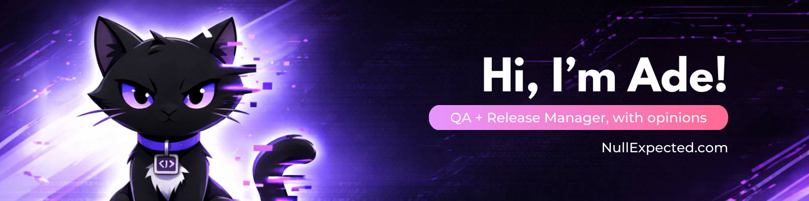

# Andreea (Ade) Vitan

QA management + release management + technical delivery.  
I make shipping predictable - without turning QA into a gate or a vibe.

<a href="https://nullexpected.com">nullexpected.com</a> • <a href="https://www.amazon.com/stores/Andreea-Vitan/author/B0GF1PPWMN">Amazon books</a> • <a href="https://www.linkedin.com/in/andreeavitan/">LinkedIn</a>

> Null Expected - A QA thought hub. What did you expect?

  
  
  
  
  
  
  
  
  

---

## Null Expected

Null Expected is where I write and build around QA leadership, test strategy, and release decision-making - the stuff that determines whether a team ships safely or just ships loudly.

If you want the longer-form version of my thinking, my books live here: https://www.amazon.com/stores/Andreea-Vitan/author/B0GF1PPWMN

## What I actually do

I lead quality and releases in environments where “we’ll fix it later” becomes an incident, a rollback, or a very expensive meeting. My focus is delivery control: making scope, risk, readiness, and release decisions visible early enough to change outcomes.

That means test strategy that fits the product and the constraints (not generic templates), and release management that treats dependencies, cutovers, and operational risk as first-class problems. I’m comfortable in the messy middle between product, engineering, and stakeholders - where the real work is.

## How I work

I’m not here for QA theatre. I’m here for clarity that holds up under pressure.

I prefer a small number of strong signals over a lot of busywork: what can break, how we’ll know, what we’ll do if it does, and who owns the call. I write things down, I make tradeoffs explicit, and I keep governance lightweight but real - so it actually gets used when the release is tense and time is short.

## If you’re hiring

I’m a fit for Release Manager, QA Manager, and technical delivery roles where you want someone who can run the room, surface risk early, and ship without drama.

Message me on LinkedIn.

<b>Extra nerd stuff</b>

I’ve played World of Warcraft since 2006 - Combat Rogue called <b>Theine</b>. Also: BG3, D&D, fantasy books, and an unreasonable number of cacti and succulents.

