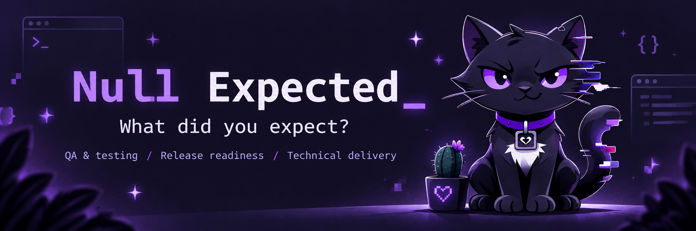

# What did you expect? 🌵

**QA & testing · Test management · Release readiness · Technical delivery**

I test software, help teams organise their QA, and coordinate the work behind a release. Sometimes that means investigating an API response. Sometimes it means finding out that everyone had a different definition of “done”.

My background spans 13+ years across large-scale enterprise platforms and SaaS products. These days, I work independently through **Null Expected**, combining hands-on testing with test leadership and technical delivery.

[Website & blog](https://nullexpected.com) · [LinkedIn](https://www.linkedin.com/in/adevitan/)

## What I work on 🧰

**Hands-on QA:** manual and exploratory testing, APIs, integrations, accessibility, compatibility and defect investigation.

**Test leadership:** risk-based strategy, requirements and acceptance criteria, UAT, supplier deliverables and test evidence.

**Release and delivery:** planning, dependencies, defect coordination, readiness and go/no-go recommendations.

**QA setup:** helping teams establish useful test practices, choose tools and create standards they can adapt as they grow.

Recent consultancy work includes building a tiered QA service catalogue and supporting it with test strategies, test-case standards and Jira defect workflows. I also test products directly, including e-commerce journeys, backend APIs and payment flows.

## At the keyboard ⌨️

**Testing & traceability:** `Jira` · `Xray` · `TestRail` · `Confluence`  
**APIs & data:** `Postman` · `Swagger/OpenAPI` · `SQL`  
**Release & automation support:** `ServiceNow` · `GitHub Actions` · `GitLab CI/CD` · `Playwright` · `Cypress`

I use automation and AI-assisted workflows where they help with testing, investigation and reporting. Reviewing the output is part of the work.

I like clear bug reports, useful documentation and processes that earn their place. Still interested in what happens when you leave the field empty.

## Open to work 🟢

**Senior QA / Test Analyst · Test/QA Manager · UAT Lead · Release Manager · Technical Delivery Manager**

Looking for **fully remote work from Romania**. EU citizen, open to employment, B2B/PFA contracts, interim assignments and part-time consultancy.

I’m interested in hands-on roles as well as leadership work. The responsibilities and team matter more to me than the title.

[Let’s talk about the work](https://www.linkedin.com/in/adevitan/)

---

<b>Extra nerd stuff</b> 🎮🌵

WoW rogue since 2006. BG3, D&D, Civ VI, AoE II. Fantasy reader and author. Keeper of an unreasonable number of cacti and succulents.

[Books I've written](https://www.amazon.com/stores/Andreea-Vitan/author/B0GF1PPWMN)

